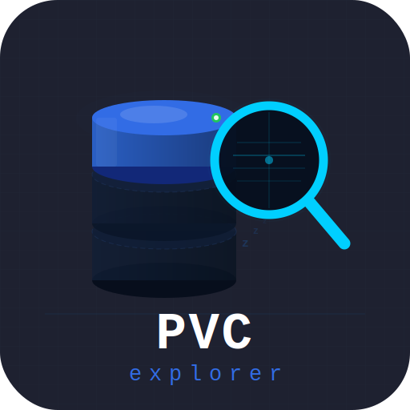

<p align="center">
	
</p>

<p align="center">
	<a href="LICENSE"></a>
	<a href="https://go.dev"></a>
	<a href="https://kubernetes.io"></a>
	<a href="https://book.kubebuilder.io"></a>
	<a href="https://vuejs.org"></a>
	<a href="https://www.typescriptlang.org"></a>
</p>

<p align="center">
	<strong>PVC-Explorer</strong> is an open-source <strong>Kubernetes</strong> controller for browsing <strong>PersistentVolumeClaims</strong> on demand. It keeps agents scaled to zero until someone needs them, then wakes them up for a short interactive session.
</p>

> [!IMPORTANT]
> This project never creates, deletes, or modifies PVCs. It only manages the ephemeral agent pods that mount them.

> [!NOTE]
> This project was developed with heavy use of AI-based coding tools from its inception — it's an experiment in human-AI collaboration as much as a Kubernetes operator.

## Community

- [Contributing guide](CONTRIBUTING.md)
- [Code of Conduct](CODE_OF_CONDUCT.md)
- [Security policy](SECURITY.md)

## Highlights

- Scale-to-zero by default, with on-demand wake-up for interactive sessions
- Safe read-only fallback when other workloads are using the PVC
- Web dashboard, file browser, and agent lifecycle managed from a single controller
- Kubernetes-native auth, theming, and release automation

## 🚀 Getting Started

Start with the short guide in [docs/getting-started.md](docs/getting-started.md).

If you want the implementation details, read [docs/architecture.md](docs/architecture.md).

For release and versioning details, see [docs/releases.md](docs/releases.md).

### Quick start

```bash
kind create cluster --config kind/cluster.yaml
make docker-build IMG=pvc-explorer:dev
kind load docker-image pvc-explorer:dev --name pvc-explorer
make install && make deploy IMG=pvc-explorer:dev
kubectl apply -k config/samples/
```

See [docs/getting-started.md](docs/getting-started.md) for the full guide, dev-mode workflow and `kind/` helper scripts.

## 📚 Documentation

| Topic                             | Location                                           |
| --------------------------------- | -------------------------------------------------- |
| Contributor workflow              | [CONTRIBUTING.md](CONTRIBUTING.md)                 |
| Development workflow              | [docs/development.md](docs/development.md)         |
| Local setup and first run         | [docs/getting-started.md](docs/getting-started.md) |
| Overview and runtime architecture | [docs/architecture.md](docs/architecture.md)       |
| Release and versioning            | [docs/releases.md](docs/releases.md)               |
| Security reporting                | [SECURITY.md](SECURITY.md)                         |

## 🤝 Contributing

Contributions are welcome. Start with [CONTRIBUTING.md](CONTRIBUTING.md) and look for issues labelled `good first issue` when you want something small to pick up.

## 👨‍💻 Maintainers

This project is maintained in public. If you need help, open an issue or start a discussion in the repository.

## 🎨 Branding

Logo variants and branding assets are available in [`docs/branding/`](docs/branding/):

- `logo.svg` — Main dark mode logo (512×512)
- `logo-light.svg` — Light mode variant for light backgrounds
- `logo-no-bg.svg` — Transparent background variant (for UI overlays)
- `logo-ui-bg.svg` — Dark mode logo with UI background (#1e2130)
- `logo-icon.svg` — Icon-only variant (for favicons, badges)
- `logo-wordmark.svg` — Horizontal wordmark (900×200)
- `logo-favicon.svg` — Small favicon variant (64×64)

## 📝 License

Apache License 2.0. See [LICENSE](LICENSE).
