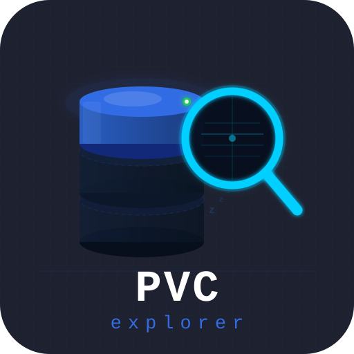

<p align="center">
  
</p>

<p align="center">
  <strong>Core Stack</strong><br>
  <a href="https://go.dev"></a>
  <a href="https://kubernetes.io"></a>
  <a href="https://book.kubebuilder.io"></a>
  <a href="https://vuejs.org"></a>
  <a href="https://www.typescriptlang.org"></a>
</p>

<p align="center">
  <strong>Security &amp; Compliance</strong><br>
  <a href="LICENSE"></a>
  <a href="https://scorecard.dev/viewer/?uri=github.com/pvc-explorer-operator/pvc-explorer"></a>
  <a href="https://github.com/pvc-explorer-operator/pvc-explorer/actions/workflows/scorecard.yml"></a>
  <a href="https://www.bestpractices.dev/projects/13031"></a>
</p>

<p align="center">
  <strong>PVC-Explorer</strong> is an open-source <strong>Kubernetes</strong> controller for browsing <strong>PersistentVolumeClaims</strong> on demand. It keeps agents scaled to zero until someone needs them, then wakes them up for a short interactive session.
</p>

# PVC Explorer Operator

PVC Explorer is a Kubernetes-native operator for platform teams to inspect, debug, and explore files on idle or active Persistent Volume Claims (PVCs) safely, without disrupting running workloads.

> [!IMPORTANT]
> This project never creates, deletes, or modifies PVCs. It only manages the ephemeral agent pods that mount them.

> [!NOTE]
> **Development philosophy:** This project was engineered with heavy utilization of AI-based pair-programming tools from its inception. It is a practical experiment in human-AI collaboration: AI accelerates prototyping and boilerplate generation, while humans retain architectural ownership, validation, and guardrail verification.
>
> We publish methodology and outcomes in [docs/operations/ai-collaboration-insights.md](docs/operations/ai-collaboration-insights.md).

## Community

- [Contributing guide](CONTRIBUTING.md)
- [Collaborator access and least-privilege policy](CONTRIBUTING.md#collaborator-access-and-least-privilege)
- [Code of Conduct](CODE_OF_CONDUCT.md)
- [Security policy](SECURITY.md)
- [Repository protection policy](docs/operations/branch-protection.md)

> [!WARNING]
> To report a security vulnerability, do not open a public issue. Use the private reporting flow in [SECURITY.md](SECURITY.md).

## Why PVC Explorer?

- Scale-to-zero by default, with on-demand wake-up for interactive sessions
- Safe read-only fallback when other workloads are using the PVC
- Web dashboard, file browser, and agent lifecycle managed from a single controller
- Kubernetes-native auth, theming, and release automation

## How it Works

1. Submit the Custom Resource:
Create and apply a `PVCExplorer` resource in the namespace that contains the target PVC.

2. Reconciliation and Validation:
The controller validates the target PVC and computes a safe mount strategy based on current consumers and access mode.

3. Ephemeral Agent Lifecycle:
An explorer agent is created and managed by the controller, then scaled to zero after inactivity (or kept running in deployment mode).

4. Storage Exploration:
Use the UI/API to inspect file structures and metadata while the operator enforces lifecycle and mount guardrails.

### Production Safety Guardrails

> Read-only safety fallback:
> When active PVC consumers are detected, explorer mounts are forced read-only.
>
> Workload-preserving design:
> The operator manages dedicated explorer agents and does not mutate existing application pod specs.
>
> Namespace and RBAC boundaries:
> Access is mediated by Kubernetes namespace scope and project auth controls.

## PVCExplorer Custom Resource Example

```yaml
apiVersion: pvcexplorer.io/v1alpha1
kind: PVCExplorer
metadata:
  name: inspect-legacy-data
  namespace: production
spec:
  pvcName: active-assets-pvc
  mode: ScaledToZero
  forceRW: false
  scaling:
    idleTimeout: "10m"
```

## Capability Comparison

| Capability           | PVC Explorer Operator                                 | Manual kubectl debug pods                      |
| -------------------- | ----------------------------------------------------- | ---------------------------------------------- |
| Auditability         | Kubernetes resources, events, and controller logs     | Ad hoc terminal history and ephemeral commands |
| Automation           | Declarative via CRDs and reconciliation               | Manual pod creation and volume wiring          |
| Data safety controls | Mount strategy and read-only fallback enforcement     | Operator discipline only; easy to misconfigure |
| Multi-tenant fit     | Namespace-scoped workflows with project auth controls | Often requires elevated cluster-level access   |

## AI Collaboration Insights

To keep this experiment transparent and useful to the community, we document how AI-assisted development is measured and reviewed in [docs/operations/ai-collaboration-insights.md](docs/operations/ai-collaboration-insights.md).

See [docs/architecture.md](docs/architecture.md) for the full runtime design.

## 🚀 Getting Started

See the docs index at [docs/README.md](docs/README.md) for a guided map of all documentation.

Start with the short guide in [docs/getting-started.md](docs/getting-started.md).

If you want the implementation details, read [docs/architecture.md](docs/architecture.md).

For release and versioning details, see [docs/releases.md](docs/releases.md).

### Quick start

```bash
kind create cluster --config kind/cluster.yaml
make docker-build IMG=pvc-explorer:dev
kind load docker-image pvc-explorer:dev --name pvc-explorer
make install && make deploy IMG=pvc-explorer:dev
kubectl apply -k config/samples/
```

See [docs/getting-started.md](docs/getting-started.md) for the full guide, dev-mode workflow and `kind/` helper scripts.

## Installation via Helm / kubectl

### Installation via kubectl (Kustomize)

```bash
kubectl apply -k config/default
```

### Installation via Helm

```bash
helm install pvc-explorer ./helm/pvc-explorer --namespace pvc-explorer-system --create-namespace
```

For full installation options and environment-specific setup, see [docs/getting-started.md](docs/getting-started.md).

## 📚 Documentation

| Topic                                 | Location                                             |
| ------------------------------------- | ---------------------------------------------------- |
| API reference (CRDs, REST, WebSocket) | [site/docs/api/](site/docs/api/index.md)             |
| Contributor workflow                  | [CONTRIBUTING.md](CONTRIBUTING.md)                   |
| Development workflow                  | [docs/development.md](docs/development.md)           |
| Documentation index                   | [docs/README.md](docs/README.md)                     |
| Local setup and first run             | [docs/getting-started.md](docs/getting-started.md)   |
| Overview and runtime architecture     | [docs/architecture.md](docs/architecture.md)         |
| Release and versioning                | [docs/releases.md](docs/releases.md)                 |
| Security reporting                    | [SECURITY.md](SECURITY.md)                           |
| UI accessibility guide                | [docs/ui/accessibility.md](docs/ui/accessibility.md) |
| UI component & contributor docs       | [docs/ui/](docs/ui/)                                 |

## 🤝 Contributing

Contributions are welcome. Start with [CONTRIBUTING.md](CONTRIBUTING.md) and look for issues labelled `good first issue` when you want something small to pick up.

## 👨‍💻 Maintainers

This project is maintained in public. If you need help, open an issue or start a discussion in the repository.

Maintainer roles, responsibilities, and sensitive-access scope are documented in [MAINTAINERS.md](MAINTAINERS.md).

## 🎨 Branding

Logo variants and branding assets are available in [`docs/branding/`](docs/branding/):

- `logo.svg` — Main dark mode logo (512×512)
- `logo-light.svg` — Light mode variant for light backgrounds
- `logo-no-bg.svg` — Transparent background variant (for UI overlays)
- `logo-ui-bg.svg` — Dark mode logo with UI background (#1e2130)
- `logo-icon.svg` — Icon-only variant (for favicons, badges)
- `logo-wordmark.svg` — Horizontal wordmark (900×200)
- `logo-favicon.svg` — Small favicon variant (64×64)

## 📝 License

Apache License 2.0. See [LICENSE](LICENSE).
