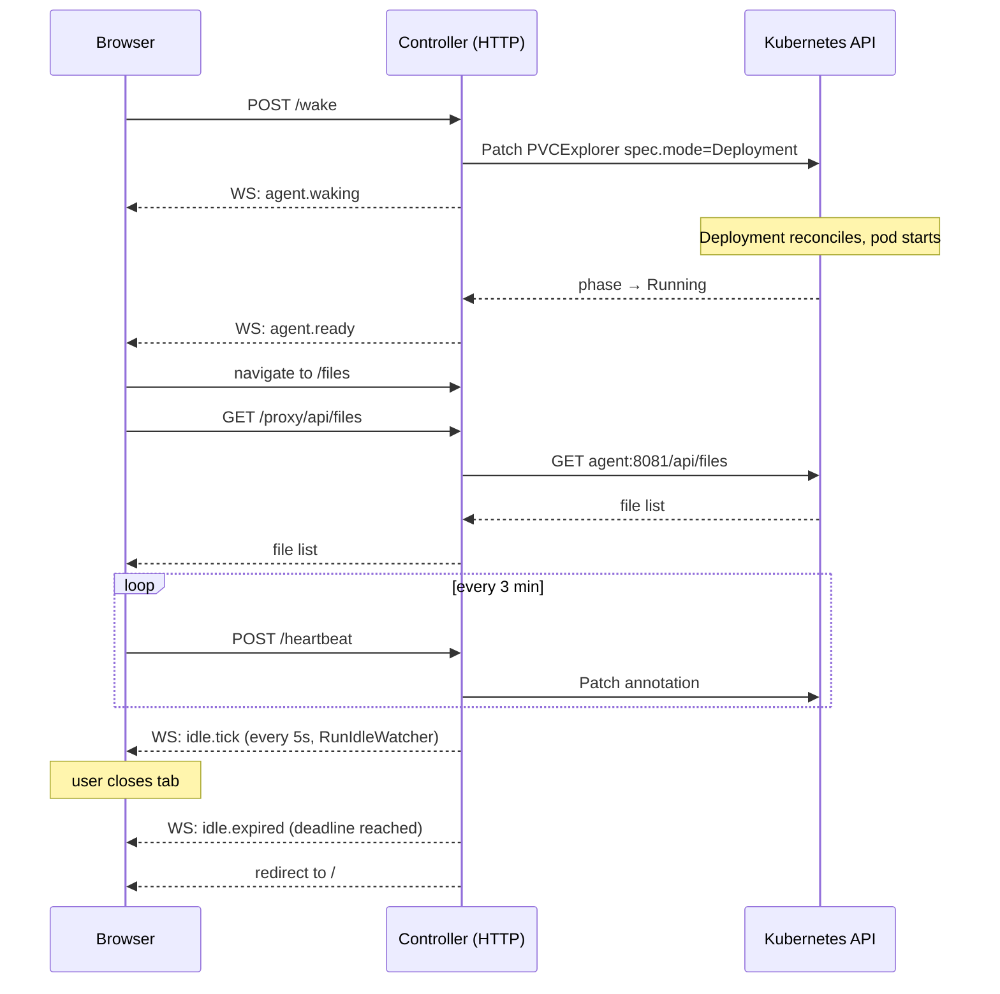

# Architecture

## Overview

pvc-explorer is a single binary that embeds:

- Two Kubernetes reconcilers (Go, controller-runtime)
- An HTTP/WebSocket server serving the REST API and Vue SPA
- A background idle-watcher goroutine

Everything runs inside one pod in `pvc-explorer-system`. The binary has no external database; all state is in Kubernetes objects and a short in-memory event ring buffer.

---

## Components

### 1. CRDs

Two custom resources, API group `pvcexplorer.io/v1alpha1`.

**PVCExplorerScope** (cluster-scoped)
Represents a set of namespaces to monitor. The scope reconciler reads this and creates/deletes `PVCExplorer` CRs. Deletion policy controls whether those CRs are cleaned up or orphaned when the scope is deleted.

**PVCExplorer** (namespaced)
Represents one agent managing one PVC. The agent reconciler reconciles this into a Deployment and Service in the same namespace as the PVC.

Relationship:
```
PVCExplorerScope (cluster-scoped)
  └── PVCExplorer  (namespaced, one per PVC)
        └── Deployment  (replicas 0 or 1)
        └── Service
```

Source: `api/v1alpha1/pvcexplorer_types.go`, `api/v1alpha1/pvcexplorerscope_types.go`

---

### 2. Reconcilers

#### Scope reconciler (`internal/controller/scope_reconciler.go`)

Watches `PVCExplorerScope` and `Namespace` objects. On each reconcile:

1. Resolves the target namespace list (explicit names + label selector).
2. Lists all Bound PVCs in those namespaces (Auto discovery mode).
3. Creates a `PVCExplorer` CR for any PVC that doesn't have one.
4. Deletes `PVCExplorer` CRs for PVCs that are no longer in scope.
5. On scope deletion, either deletes all owned CRs (Cleanup) or removes the finalizer and leaves them (Orphan).

The scope reconciler never touches Deployments or Services directly — those are owned by `PVCExplorer`, managed by the agent reconciler.

#### Agent reconciler (`internal/controller/agent_reconciler.go`)

Watches `PVCExplorer`, owned `Deployment` objects, and `Pod` events in registered namespaces.

On each reconcile:

1. Validates the PVC exists and is Bound.
2. Reads the consumer index (`internal/consumer.Index`) for this PVC.
3. Runs `mountPolicy` to decide `readOnly`, `targetNode`, and `strategy`.
4. Calls `reconcileDeployment` — creates or patches the Deployment.
5. Calls `reconcileService` — creates or patches the Service.
6. Calls `syncStatus` — derives the phase from Deployment ready replicas and patches `PVCExplorer.status`.
7. If phase transitions to `Running` and was not `Running` before, broadcasts `agent.ready`.

Phase derivation (`derivePhase`):

```
desired replicas == 0:
  ReadyReplicas == 0  -> ScaledToZero
  ReadyReplicas > 0   -> Waking (scaling down in progress)

desired replicas == 1:
  ReadyReplicas >= 1  -> Running
  UnavailableReplicas > 0 -> Failed
  else                -> Waking
```

Pod watch predicate: only enqueues pods that mount a PVC AND are in a registered namespace AND have a phase change. This eliminates metadata-only pod churn before it reaches the work queue.

---

### 3. Consumer index (`internal/consumer/`)

`Index` is an in-memory map of `(namespace, pvcName) -> []ConsumerInfo`. It is updated by `Sync`, which is called from the pod watch handler in the agent reconciler.

`Sync` rescans all Running/Pending pods in the namespace, resolves the owner chain for each pod (Pod→ReplicaSet→Deployment, Pod→Job→CronJob), and diffs the result against the previous state. For each added or removed pod, it publishes `consumer.attached` or `consumer.detached` over the broadcaster.

`Index` accepts a `consumerBroadcaster` interface at construction time (`NewIndexWithBroadcaster`). The interface requires only `Publish(string, any) error`, which avoids importing the `api` package from `consumer` and prevents an import cycle.

Source: `internal/consumer/index.go`, `internal/consumer/detect.go`

---

### 4. Scaler (`internal/scaler/scaler.go`)

Owns the idle lifecycle logic. Three operations:

**WakeAgent** — patches `spec.mode` to `Deployment` and sets the `pvcexplorer.io/idle-deadline` annotation to `now + idleTimeout`. Resets the warn state for this explorer.

**SleepAgent** — patches `spec.mode` to `ScaledToZero` and removes the deadline annotation.

**ResetIdleTimer** — called by the heartbeat endpoint. Patches the deadline to `now + idleTimeout`, resets warn state, and broadcasts `idle.tick` with the new remaining seconds.

**RunIdleWatcher** — background goroutine started from `cmd/main.go` after the cache syncs. Ticks every 5 seconds. For each Running explorer with a deadline annotation:
- Broadcasts `idle.tick` with remaining seconds.
- Broadcasts `idle.warning` once when remaining drops to or below 60 seconds (gated by a per-explorer `warnState` map).
- Calls `SleepAgent` and broadcasts `idle.expired` when remaining reaches zero.

The idle watcher uses a `Broadcaster` interface (same `Publish(string, any) error` shape) to avoid importing `internal/api` from `internal/scaler`.

Source: `internal/scaler/scaler.go`

---

### 5. HTTP / WebSocket server (`internal/api/`)

Registered on a single `http.ServeMux` in `cmd/main.go`. Auth middleware wraps the entire mux.

**REST routes** (`rest.go`):

```
GET    /api/v1/scopes
GET    /api/v1/scopes/{name}
POST   /api/v1/scopes
PUT    /api/v1/scopes/{name}
DELETE /api/v1/scopes/{name}

GET    /api/v1/explorers
GET    /api/v1/explorers/{ns}/{name}
POST   /api/v1/explorers
PUT    /api/v1/explorers/{ns}/{name}
DELETE /api/v1/explorers/{ns}/{name}

POST   /api/v1/explorers/{ns}/{name}/wake
POST   /api/v1/explorers/{ns}/{name}/heartbeat
ANY    /api/v1/explorers/{ns}/{name}/proxy/*
GET    /api/v1/theme
PUT    /api/v1/theme
GET    /api/v1/health
```

The proxy routes forward requests to the agent's in-cluster Service (`http://<name>.<ns>.svc.cluster.local:8081`). This means the dashboard never needs direct access to agent pods.

**WebSocket** (`ws.go`):

`Broadcaster` is a struct with a mutex-protected client map and a 500-frame ring buffer. `Publish(eventType string, payload any)` serialises the payload to JSON, builds a `WSFrame` with a monotonic ID, appends it to the ring buffer, and fans it out to all connected clients.

On connection, the server sends a `snapshot` frame with the current explorer and scope lists. If the client passes `?since=<id>`, it replays buffered frames with IDs after that value before adding the client to the live fan-out. This gives short disconnections (browser tab background, brief network blip) a best-effort replay without any external message queue.

**Auth** (`auth.go`):

Login endpoint reads the `pvc-explorer-auth` Secret via the controller's API reader, bcrypt-compares the submitted password, and sets a session cookie. Role is derived from the username: `admin` by default, or any username listed in the `adminUsers` key of the `pvc-explorer-config` ConfigMap.

Middleware reads the session cookie on every request to `/api/v1/*` and `/ws/v1/*`. Role is stored in the request context and checked per-route for write operations.

---

### 6. Frontend (`ui/src/`)

Vue 3 SPA, compiled with Vite, embedded in the Go binary via `embed.FS` at `ui/dist`.

**State** is managed by Pinia stores (`explorerStore.ts`). On mount, `App.vue` opens a WebSocket via `useWebSocket`. The `snapshot` frame populates the stores. Subsequent `explorer.updated`, `explorer.deleted`, `scope.updated`, `scope.deleted` frames keep the stores live without polling.

**`useWebSocket.ts`** is the single WebSocket connection for the app. It accepts a `WebSocketCallbacks` object with optional handlers for every event type. It reconnects with exponential backoff and sends `?since=<last-id>` on reconnect. Components that need event-driven behaviour (FileBrowserView, WakeUpDialog) pass callbacks at mount time.

**Idle flow in FileBrowserView**:
- `idle.tick` sets `remainingSeconds` from the server value.
- `idle.warning` shows an inline banner with a "Keep Alive" button that calls the heartbeat endpoint.
- `idle.expired` redirects to `/`.
- The heartbeat HTTP call runs every 3 minutes as a passive keepalive regardless of WS events.

**Wake flow in WakeUpDialog**:
- Sends `POST /api/v1/explorers/{ns}/{name}/wake`.
- Opens a WebSocket and waits for `agent.ready` with matching namespace and name.
- Falls back to a 120-second timeout if the event never arrives.
- No polling loop.

---

## Data flow: user browses a PVC



---

## Broadcaster interface pattern

Three packages publish WebSocket events: `internal/api` (REST mutations), `internal/scaler` (idle watcher), and `internal/controller` (agent ready). Only `internal/api` can import `internal/api`. The other two packages define a minimal local interface:

```go
// in internal/scaler/scaler.go
type Broadcaster interface {
    Publish(eventType string, payload any) error
}

// in internal/controller/agent_reconciler.go
type agentBroadcaster interface {
    Publish(eventType string, payload any) error
}

// in internal/consumer/index.go
type consumerBroadcaster interface {
    Publish(eventType string, payload any) error
}
```

`*api.Broadcaster` satisfies all three because its method signature matches. `cmd/main.go` constructs one `*api.Broadcaster` and passes it to all three. No import cycles.

`Broadcaster.Publish` accepts `string` rather than `EventType` so the method signature is compatible with the local interfaces. Inside `ws.go`, the string is cast back to `EventType` when building the frame.

See `docs/adr/001-broadcaster-string-interface.md`.

---

## Key invariants

- The controller never modifies PVCs or PersistentVolumes.
- `SleepAgent` / `WakeAgent` only patch `spec.mode` and the `idle-deadline` annotation. They do not touch the Deployment directly — the agent reconciler reacts to the spec change.
- `syncStatus` reads the current phase from `explorer.Status.Phase` before patching (to detect the `Running` transition) because the agent reconciler may be called many times while the deployment is warming up.
- The consumer index is read under RLock and written under Lock. Events are published after the lock is released to avoid holding the mutex during network I/O.
- The idle watcher publishes `idle.warning` at most once per wake session per explorer. `warnState` is reset by `WakeAgent` and `ResetIdleTimer`.

---

## Adding a new WebSocket event

1. Add the constant to `internal/api/ws_types.go`.
2. Call `broadcaster.Publish("your.event", payload)` from the package that detects the condition. If the package cannot import `internal/api`, define a local one-method interface (see the broadcaster interface pattern above).
3. Add the case to the `switch` in `ui/src/composables/useWebSocket.ts`.
4. Add a typed payload interface and optional callback to `WebSocketCallbacks` in the same file.

---

## Adding a new REST endpoint

1. Write the handler method on `RestHandler` in `internal/api/rest.go`.
2. Register the route in `RegisterRoutes`.
3. If the route requires admin-only access, add it to the permission table in `internal/api/auth.go`.

---

## Running tests

```bash
make test
```

Tests use controller-runtime's envtest (real Kubernetes API server + etcd binary, no cluster required). Test binaries are downloaded to `bin/` by `make test` on first run. See `internal/controller/suite_test.go` for the test suite setup.
