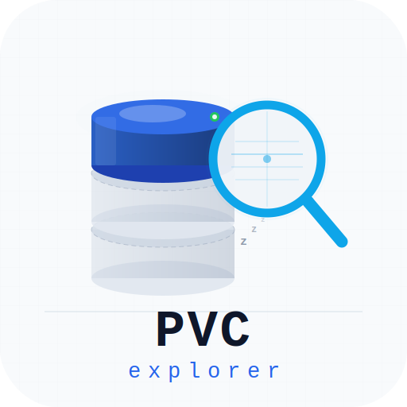

# PVC Explorer Branding Assets

This directory contains official logo and branding assets for PVC Explorer. All files are available under the same license as the project (Apache License 2.0).

## Logo Variants

### Main Logos

| File | Purpose | Background | Use Case |
|------|---------|-----------|----------|
| `logo.svg` | **Primary dark logo** | Dark (#1e2130) with grid | Dark backgrounds, GitHub, documentation |
| `logo-light.svg` | **Primary light logo** | Light (#f1f5f9) with grid | Light backgrounds, light mode UIs |
| `logo-no-bg.svg` | **Transparent variant** | Transparent | UI overlays, badges, complex layouts |
| `logo-ui-bg.svg` | **UI integrated** | Dark (#1e2130) to match sidebar | Web UI, dashboards |

### Special Variants

| File | Purpose | Size | Use Case |
|------|---------|------|----------|
| `logo-icon.svg` | **Icon only** (no text) | Flexible (cropped to 420×300) | Favicons, app icons, badges |
| `logo-wordmark.svg` | **Horizontal wordmark** | 900×200 | Headers, banners, horizontal layouts |
| `logo-favicon.svg` | **Small favicon** | 64×64 | Browser tabs, favorites |

## Design Elements

### Color Palette

**Dark Theme:**
- Primary Blue: `#326CE5` (Kubernetes blue)
- Accent Cyan: `#00CFFF` (magnifying glass glow, active highlights)
- Success Green: `#22C55E` (active/enabled state)
- Dim Border: `#1E3660` (inactive borders)
- Background: `#1e2130` (dark UI background)
- Grid: `#2a3348` (subtle grid lines)

**Light Theme:**
- Primary Blue: `#2563eb` (lighter Kubernetes blue)
- Accent Purple: `#8b5cf6` (light mode accent)
- Background: `#f1f5f9` (light slate)
- Grid: `#cbd5e1` (visible grid lines)

### Design System

The logo features:
- **3 stacked cylinders** — representing PersistentVolumeClaims (PVCs)
- **Active/dim states** — visual representation of scale-to-zero behavior
- **Magnifying glass** — symbol of exploration and discovery
- **Cyan glow effect** — highlights interactivity and modern technology
- **Grid background** — suggests cloud-native infrastructure
- **Monospace typography** — "PVC" and "explorer" labels in Courier New

## Usage Guidelines

### Dark Mode (Primary)
Use `logo.svg` or `logo-ui-bg.svg` for:
- Dark backgrounds
- GitHub README files (displayed in dark theme)
- Dark mode web applications
- Printed materials with dark themes

### Light Mode
Use `logo-light.svg` for:
- Light backgrounds
- Light mode web applications
- Printed materials with light themes
- High-contrast scenarios

### Icon Only
Use `logo-icon.svg` for:
- Favicons and app icons
- Badges and social media
- Small display sizes (<100px)

### Wordmark
Use `logo-wordmark.svg` for:
- Horizontal banners
- Section headers
- Wide layouts

### Favicon
Use `logo-favicon.svg` for:
- Browser tabs
- Bookmarks
- Smallest display sizes

## Integration Examples

### In Web UI (Vue.js)
```html
<!-- Transparent variant for UI overlays -->


<!-- Responsive dark/light mode -->


```

### In Markdown
```markdown

```

### In HTML
```html

```

## Technical Specifications

- **Format**: SVG (Scalable Vector Graphics)
- **Viewbox**: 512×512 (except wordmark: 900×200, favicon: 64×64)
- **License**: Apache License 2.0
- **Generated**: Kubebuilder-based logo design, 2026

## Contributing to Branding

To suggest changes to the logo or branding assets:

1. Open an issue describing the suggested change
2. Include mockups or design rationale
3. Wait for maintainer feedback before implementing

Keep in mind:
- The logo should remain recognizable and consistent across variants
- All variants must maintain the core identity (cylinders + magnifying glass)
- Color palette should stay aligned with Kubernetes and modern cloud-native aesthetics

## License

All branding assets are provided under the **Apache License 2.0**. You are free to use, modify, and redistribute these assets in accordance with the license terms.
