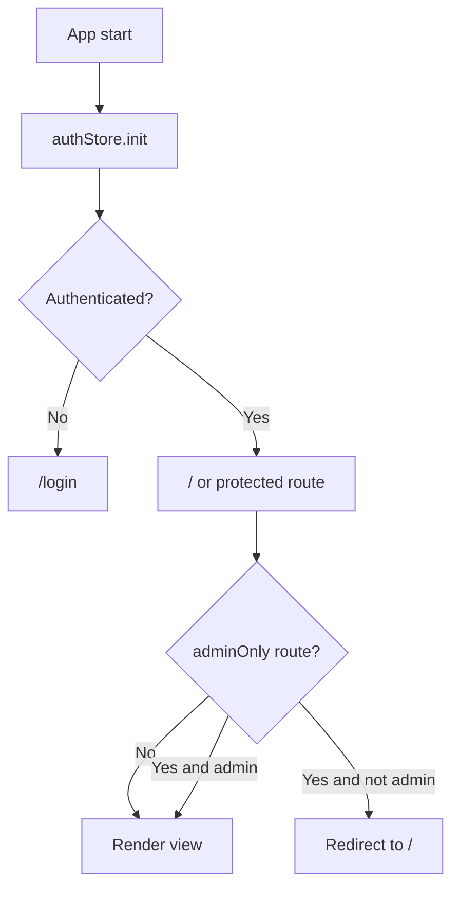
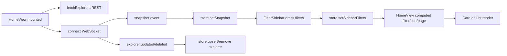
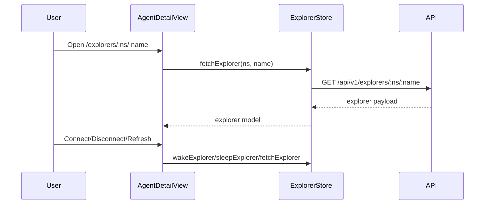
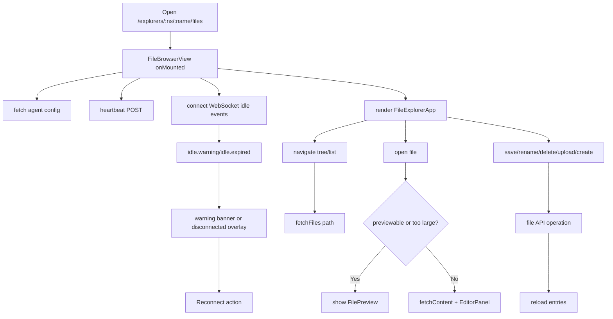
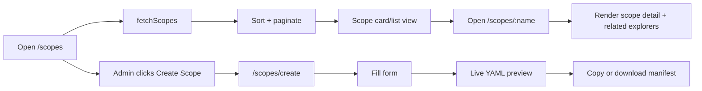

# UI Flows

This page describes the UI user flows and data flows, including auth, list and detail navigation, and the file browser lifecycle.

## Route and access flow

Implementation references:

- Route guards: `ui/src/router/index.ts`
- Auth state: `ui/src/stores/authStore.ts`

## Explorer dashboard flow

Implementation references:

- View: `ui/src/views/HomeView.vue`
- Store: `ui/src/stores/explorerStore.ts`
- Realtime: `ui/src/composables/useWebSocket.ts`
- Filters: `ui/src/components/filters/FilterSidebar.vue`

## Explorer detail flow

Implementation references:

- View: `ui/src/views/AgentDetailView.vue`
- Store methods: `ui/src/stores/explorerStore.ts`

## File browser flow

Implementation references:

- View: `ui/src/views/FileBrowserView.vue`
- API adapter: `ui/src/api/files.ts`
- Workspace container: `ui/src/components/files/FileExplorerApp.vue`

## Scope flow

Implementation references:

- Scope list: `ui/src/views/ScopeListView.vue`
- Scope detail: `ui/src/views/ScopeDetailView.vue`
- Scope create: `ui/src/views/CreateScopeView.vue`
