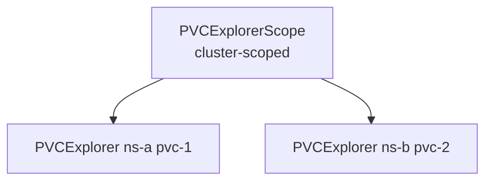

# CRDs

## Overview

PVC Explorer uses two CRDs in API group `pvcexplorer.io/v1alpha1`.

- `PVCExplorerScope`: cluster-scoped registration and defaults
- `PVCExplorer`: namespaced explorer instance per PVC

## API Specification

| Resource | Version | Scope | Short name | Status subresource |
| --- | --- | --- | --- | --- |
| PVCExplorer | pvcexplorer.io/v1alpha1 | Namespaced | pvcexp | Enabled |
| PVCExplorerScope | pvcexplorer.io/v1alpha1 | Cluster | pvcs | Enabled |

## Responsibility split

- `PVCExplorerScope` defines namespace selection, discovery mode, and default behavior
- `PVCExplorer` defines per-PVC runtime behavior and exposes observed status

## CRD Reference Pages

- [PVCExplorer](/api/crds/pvcexplorer)
- [PVCExplorerScope](/api/crds/pvcexplorerscope)

## Quick comparison

| Kind | Scope | Primary role |
| --- | --- | --- |
| PVCExplorer | Namespaced | Manages one explorer agent for one PVC |
| PVCExplorerScope | Cluster | Registers namespaces and defaults, then manages many PVCExplorer objects |

## Example relationships

## Notes for beta

- Keep CRD contracts minimal and explicit
- Prefer status-driven UI behavior over inferred state
- Add new fields only with clear reconciliation and UI use-cases

## Source of truth

- https://github.com/pvc-explorer-operator/pvc-explorer/blob/main/api/v1alpha1/pvcexplorerscope_types.go
- https://github.com/pvc-explorer-operator/pvc-explorer/blob/main/api/v1alpha1/pvcexplorer_types.go
