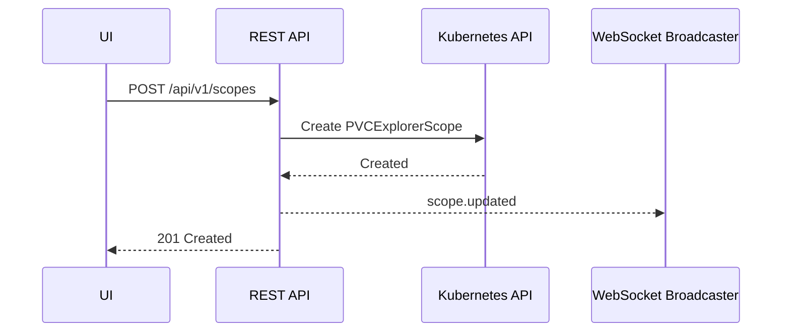

# REST

## Overview

The REST API is mounted under `/api/v1`.

## API Specification

| Field | Value |
| --- | --- |
| Base path | `/api/v1` |
| Auth style | Session cookie issued by login endpoint |
| Main consumers | Embedded UI and administrative workflows |

## Authentication and authorization

- Public routes: auth endpoints, health, theme, and static assets
- Authenticated routes: all remaining API routes
- Role model:
	- `viewer`: read access, wake/sleep/heartbeat, proxy GET
	- `admin`: full CRUD and proxy mutations

## Endpoint groups

- auth: login, logout, me
- scopes: CRUD for PVCExplorerScope objects
- explorers: CRUD, wake, sleep, heartbeat, proxy dispatch
- metadata: labels, namespaces, PVCs
- info: health, theme, version

## Endpoint matrix

| Method | Path | Purpose |
| --- | --- | --- |
| POST | `/api/v1/auth/login` | Create authenticated session |
| POST | `/api/v1/auth/logout` | Invalidate current session |
| GET | `/api/v1/auth/me` | Return current user and role |
| GET | `/api/v1/health` | Service health check |
| GET | `/api/v1/scopes` | List scopes |
| GET | `/api/v1/scopes/{name}` | Get one scope |
| POST | `/api/v1/scopes` | Create scope |
| PUT | `/api/v1/scopes/{name}` | Update scope |
| DELETE | `/api/v1/scopes/{name}` | Delete scope |
| GET | `/api/v1/explorers` | List explorers (supports filters) |
| GET | `/api/v1/explorers/{ns}/{name}` | Get one explorer |
| POST | `/api/v1/explorers` | Create explorer |
| PUT | `/api/v1/explorers/{ns}/{name}` | Update explorer |
| DELETE | `/api/v1/explorers/{ns}/{name}` | Delete explorer |
| POST | `/api/v1/explorers/{ns}/{name}/wake` | Wake scaled-down explorer |
| POST | `/api/v1/explorers/{ns}/{name}/sleep` | Scale explorer to zero |
| POST | `/api/v1/explorers/{ns}/{name}/heartbeat` | Extend idle deadline |
| ANY | `/api/v1/explorers/{ns}/{name}/proxy/api/*` | Proxy to running agent API |
| GET | `/api/v1/labels` | List labels used by explorers |
| GET | `/api/v1/namespaces` | List namespaces |
| GET | `/api/v1/namespaces/{ns}/pvcs` | List PVCs in namespace |
| GET | `/api/v1/theme` | Read runtime UI theme |
| GET | `/api/version` | Binary version string |

## Request lifecycle (example)

## Beta notes

- Keep route contracts stable while UI evolves
- Prefer additive response changes over breaking shape changes
- Use WebSocket for reactive state where possible

## Source of truth

- https://github.com/pvc-explorer-operator/pvc-explorer/blob/main/internal/api/rest.go
- https://github.com/pvc-explorer-operator/pvc-explorer/blob/main/internal/api/handlers.go
- https://github.com/pvc-explorer-operator/pvc-explorer/blob/main/internal/api/auth.go
- https://github.com/pvc-explorer-operator/pvc-explorer/blob/main/internal/api/rest_test.go
