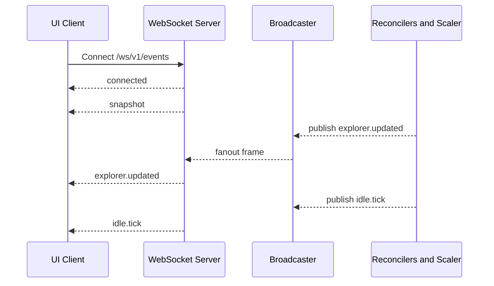

# WebSocket

## Overview

WebSocket events drive real-time UI updates for explorer lifecycle, scope changes, consumer signals, and idle countdown state.

## API Specification

| Field | Value |
| --- | --- |
| Endpoint | `/ws/v1/events` |
| Framing | JSON envelope |
| Delivery model | snapshot plus incremental events |

## Frame envelope

```json
{
	"id": "01H...",
	"type": "explorer.updated",
	"serverTime": "2026-05-26T12:00:00Z",
	"payload": {}
}
```

## Event catalog

| Event type | Purpose |
| --- | --- |
| connected | Connection handshake confirmation |
| snapshot | Initial full state payload |
| explorer.updated | Explorer status and mount changes |
| explorer.deleted | Explorer removal |
| scope.updated | Scope status or config update |
| scope.deleted | Scope removal |
| consumer.attached | Consumer workload now mounts tracked PVC |
| consumer.detached | Consumer workload released tracked PVC |
| agent.waking | Wake request accepted and startup in progress |
| agent.ready | Explorer phase reached Running |
| agent.error | Wake or runtime transition failed |
| idle.tick | Remaining idle time update |
| idle.warning | Warning threshold reached |
| idle.expired | Idle deadline reached, scale-down triggered |
| ping / pong | Connection keepalive |

## Typical event families

- explorer readiness and phase updates
- consumer attach and detach changes
- idle timer tick, warning, and expiration

## Connection and update flow



## Beta notes

- Clients should treat unknown event types as forward-compatible no-ops
- UI should prioritize idempotent store updates per event key
- Use snapshot as recovery baseline on reconnect

## Source of truth

- https://github.com/pvc-explorer-operator/pvc-explorer/blob/main/internal/api/ws.go
- https://github.com/pvc-explorer-operator/pvc-explorer/blob/main/internal/api/ws_types.go
