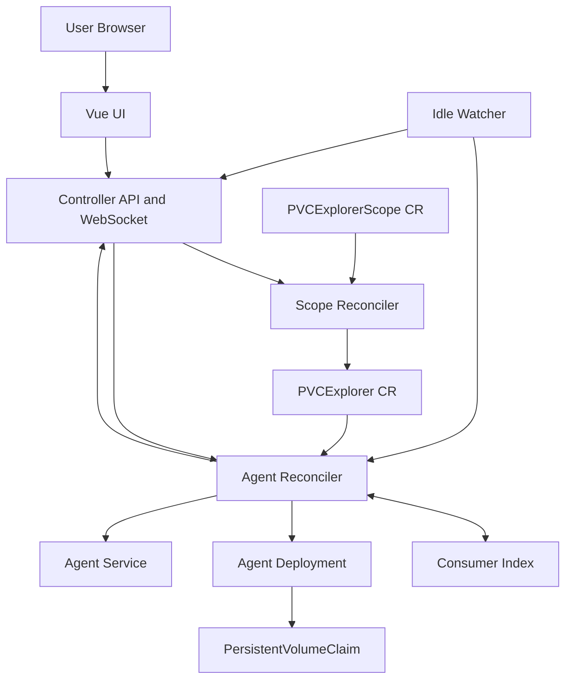
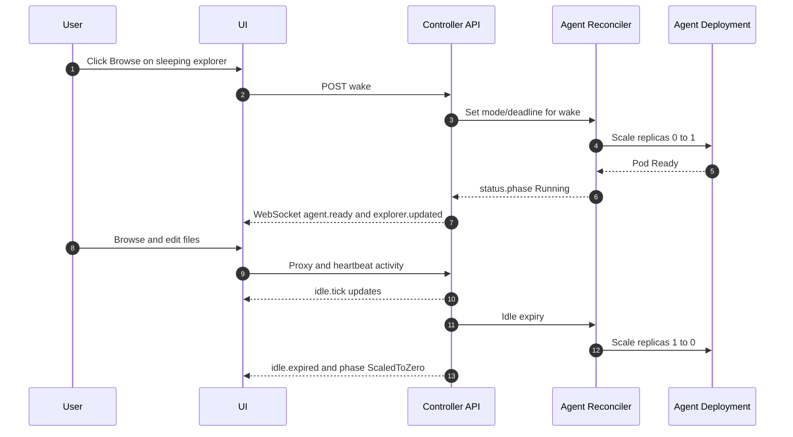

# Architecture

This page summarizes the current beta architecture.

It is based on the original requirements document and refined by accepted ADRs.

## Beta intent

- Primary use case: browse mostly idle PVCs on demand
- Default operating model: scale explorer agents to zero when idle
- Safety model: prefer read-write for idle PVCs, force read-only when active consumers are detected
- Non-goal: this project does not create, delete, or mutate PVC objects

## System overview

## Core control loops

| Loop             | Watches                                     | Main outcome                                                  |
| ---------------- | ------------------------------------------- | ------------------------------------------------------------- |
| Agent reconciler | PVCExplorer, owned Deployments, Pod signals | Reconciles Deployment and Service, mount policy, status phase |
| Consumer index   | Pod events in registered namespaces         | Tracks active PVC consumers for safety decisions              |
| Idle watcher     | Running explorers with deadline             | Publishes countdown and scales idle agents to zero            |
| Scope reconciler | PVCExplorerScope, Namespace                 | Creates and prunes PVCExplorer resources                      |

## Primary user flow (happy path)

## Safety path (consumer-aware mounting)

When consumer workloads already mount the PVC, the controller applies a safe override:

- Forces agent mount to read-only
- Uses node affinity for RWO cases when required
- Returns to read-write when consumers detach and policy allows it

This keeps the default experience simple while preventing unsafe concurrent write behavior.

## Deployment modes

- ScaledToZero (default): lowest cost, wake on demand
- Deployment: always-on explorer pod
- Knative (optional): auto-detected when available

## Event-driven UX model

The UI is updated via WebSocket events instead of polling-heavy loops.

- Snapshot and incremental explorer/scope updates
- Consumer attached and detached events
- Agent waking, ready, and error events
- Idle tick, warning, and expired events

## ADR-backed architecture decisions

- ADR 001: broadcaster uses string event types to avoid import cycles
- ADR 002: idle countdown is server-pushed over WebSocket
- ADR 003: agent.ready emitted on real phase transition to Running
- ADR 004: consumer diff uses union of old and new keys for correctness
- ADR 005: mount policy enforces read-only when consumers are present
- ADR 006: operator to agent isolation via per-agent token auth

## Agent component

The **agent** that mounts the PVC and exposes its contents over HTTP is a separate project: [`pvc-explorer-agent`](https://github.com/pvc-explorer-operator/pvc-explorer-agent).

This operator manages the agent lifecycle — it creates, wakes, scales to zero, and tears down the agent pod — but does not contain the agent implementation. The operator proxies all file-browser traffic from the UI to the running agent pod.

The agent image is pulled from `ghcr.io/pvc-explorer-operator/pvc-explorer-agent` and deployed as a regular Kubernetes Pod via the `PVCExplorer` reconciler.

## Beta boundaries

- Focused on single-cluster operation
- Basic auth and role model are intentionally simple for now
- Multi-cluster and advanced identity federation are future work
- Emphasis is correctness and operability over broad feature surface

## Source references

- https://github.com/pvc-explorer-operator/pvc-explorer/blob/main/docs/architecture.md
- https://github.com/pvc-explorer-operator/pvc-explorer/tree/main/docs/adr
- https://github.com/pvc-explorer-operator/pvc-explorer/tree/main/internal
- https://github.com/pvc-explorer-operator/pvc-explorer/tree/main/api/v1alpha1
